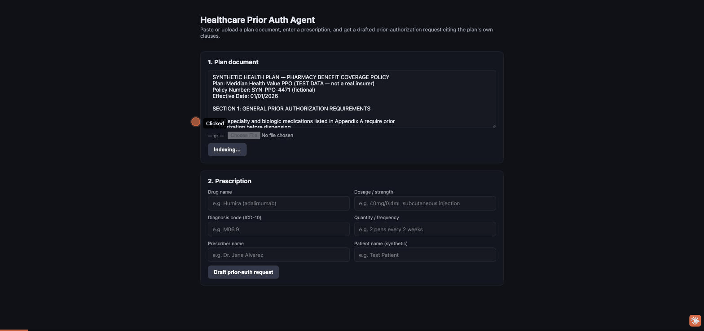

# Healthcare Prior Auth Agent



Drafting a prior-authorization (PA) request today means a clinical staffer manually
cross-referencing a member's insurance plan document against a prescription — checking
step therapy, quantity limits, diagnosis eligibility, and prescriber requirements by hand,
then writing up a justification letter. It's slow, repetitive, and error-prone.

This agent automates the first draft: point it at a plan document and a prescription, and
it retrieves the specific plan clauses that apply, deterministically checks the prescription
against them, and drafts a structured PA request letter that cites them — calling out any
coverage criteria (like step therapy) that aren't yet documented, instead of silently
assuming compliance.

**Who'd use it:** Prior-auth coordinators, payer-facing ops teams at health systems, or
health-tech startups looking to cut the manual drafting time out of PA submissions.

## How it works

1. **Index the plan document** — `POST /plan` accepts either pasted text or a PDF/text
   file upload. The document is chunked on structural boundaries (`SECTION N:` headings,
   numbered clauses like `2.2 Step therapy requirement:`), not fixed line windows — so a
   rule and its qualifying condition stay in the same chunk instead of being split across
   arbitrary 25-line boundaries. Sections too long to embed as one chunk fall back to
   overlapping line-window sub-chunks. Chunks are embedded locally with
   `sentence-transformers` (`all-MiniLM-L6-v2` — no paid embeddings API). See
   [`backend/rag.py`](backend/rag.py).
2. **Submit the prescription** — `POST /draft` takes drug name, dosage, diagnosis code
   (ICD-10), quantity/frequency, prescriber/patient fields (synthetic test data only — no
   real PHI is used or required), and an optional `step_therapy_documented` flag the
   preparer sets if they already have that documentation on file.
3. **Retrieve** — the top-k most relevant plan chunks are retrieved by cosine similarity,
   with a small keyword-match boost for chunks that literally mention the submitted drug
   name or diagnosis code — a cheap routing signal that reduces cross-section mixups (e.g.
   surfacing a quantity limit for the wrong drug class) versus pure embedding similarity
   alone. See [`backend/rag.py`](backend/rag.py).
4. **Extract structured criteria** — a single constrained LLM call (`tool_choice` forced to
   one function, not free text) transcribes the retrieved plan text into a fixed schema:
   covered ICD-10 prefixes, step-therapy requirement, quantity limit, required prescriber
   specialties, exclusions — each with a citation. The model is only asked to *transcribe*
   what the plan says, not to judge whether this patient's prescription satisfies it. See
   [`backend/criteria.py`](backend/criteria.py).
5. **Check deterministically** — plain Python, no LLM, compares the prescription against
   the extracted criteria and produces a checklist where every item is `met` / `not_met` /
   `needs_review` / `not_applicable`. `needs_review` is the load-bearing status: whenever the
   check can't confidently resolve something (missing data, fuzzy quantity units, ambiguous
   specialty match), it routes to manual review instead of guessing. See
   [`backend/criteria.py`](backend/criteria.py).
6. **Draft the letter** — the checklist is handed to the drafting LLM call as ground truth,
   with an explicit instruction not to re-derive or contradict it — the model narrates the
   checklist into a structured PA letter (Patient/Prescriber summary, Medication Requested,
   Clinical Justification, Plan Coverage Basis with inline `(plan_document:start_line-end_line)`
   citations, Requested Determination) and calls out any `not_met`/`needs_review` item as an
   open issue. It also has a `search_plan_document` tool for extra supporting context. See
   [`backend/minimax_client.py`](backend/minimax_client.py).

### Why the checklist is split from the draft

The first version of this agent had a single LLM call read the plan text and both judge
*and* narrate compliance in one pass — a coverage judgment call living entirely inside a
prompt. Splitting it into "structured extraction → deterministic check → narrate" means the
parts of the decision that are actually mechanical (does this ICD-10 code fall in this
covered range? does this quantity exceed this limit?) never depend on the LLM getting a
judgment call right from raw prose, and the LLM's job narrows to what it's actually good at:
writing the justification narrative and explaining *why* a criterion resolved the way it did.
`needs_review` is deliberately a first-class status, not a fallback to hide — the goal is a
system that's honest about what it can't confirm, not one that always produces a confident
answer.

## Tech stack

- **Backend:** FastAPI, `pypdf` for PDF text extraction, `sentence-transformers` for local
  embeddings, numpy for similarity search, MiniMax API (OpenAI-compatible) for both
  structured criteria extraction (forced function call) and letter drafting (function
  calling + tool loop).
- **Frontend:** React + Vite. Paste/upload plan doc → enter prescription → coverage
  checklist table (met/not-met/needs-review) → drafted letter with expandable
  retrieved-clause citations and tool-call trace.
- **LLM:** [MiniMax](https://platform.minimax.io) `MiniMax-M2.7` via its OpenAI-compatible
  endpoint (`https://api.minimax.io/v1`).
- **Docker:** separate images for backend and frontend, plus a `docker-compose.yml`.

## Setup

### Backend

```bash
cd backend
python3 -m venv .venv && source .venv/bin/activate
pip install -r requirements.txt

cp .env.example .env
# edit .env and set MINIMAX_API_KEY=<your key>
# get a key at https://platform.minimax.io

uvicorn main:app --reload --port 8000
```

The first request will download the `all-MiniLM-L6-v2` embedding model (~90MB), so
indexing a plan document for the first time takes a little longer.

### Frontend

```bash
cd frontend
npm install
npm run dev   # http://localhost:5173
```

If the backend isn't on `http://localhost:8000`, copy `frontend/.env.example` to
`frontend/.env` and set `VITE_API_BASE_URL`.

### Docker

```bash
# put your key in backend/.env first (see above)
docker compose up --build
```

## Environment variables

| Var | Where | Default | Purpose |
|---|---|---|---|
| `MINIMAX_API_KEY` | `backend/.env` | *(required)* | MiniMax API key — **never commit this** |
| `MINIMAX_BASE_URL` | `backend/.env` | `https://api.minimax.io/v1` | MiniMax OpenAI-compatible endpoint |
| `MINIMAX_MODEL` | `backend/.env` | `MiniMax-M2.7` | Chat model used for drafting |
| `VITE_API_BASE_URL` | `frontend/.env` | `http://localhost:8000` | Where the frontend finds the backend |

`.env` files are git-ignored; `.env.example` files show the shape without real secrets.

## Demo

A synthetic (non-PHI) plan document and prescription are in `sample_data/`:

- `sample_data/mock_plan_document.txt` — a fictional "Meridian Health Value PPO" pharmacy
  benefit policy with prior-auth criteria for biologic agents (step therapy, quantity
  limits, diagnosis eligibility, prescriber requirements, reauthorization, exclusions).
- `sample_data/mock_prescription.json` — a synthetic Humira (adalimumab) prescription for
  rheumatoid arthritis (ICD-10 M06.9).
- `sample_data/example_draft_response.json` — the actual `/draft` response from running
  that prescription against that plan document end-to-end, including the drafted letter,
  retrieved plan-clause citations, and tool trace.

Running the example: the checklist resolves diagnosis coverage, quantity limit, and
prescriber requirement to **met** (citing plan Sections 2.1, 2.3, and 2.4), and step
therapy to **needs_review** when no documentation flag is set, or to **not_met**/**met**
when the preparer explicitly indicates whether it's documented — instead of fabricating
compliance, the draft letter carries that status through verbatim and lists exactly what
documentation would be needed to close the gap.

See the GIF at the top of this README for the plan-document → prescription → drafted-letter
flow (recorded before the coverage-checklist table was added — the checklist step isn't
shown in it yet).

## Eval harness

`eval/` has a small harness that runs the retrieval → structured-extraction →
deterministic-checklist pipeline against 5 cases spanning 4 differently-structured synthetic
plan documents (different heading styles, different drug classes, an explicit
step-therapy-exempt policy, a tight quantity limit), and asserts the checklist statuses match
what's expected — including a diagnosis genuinely **not** covered and a quantity that
genuinely **exceeds** the limit, not just the happy path.

```bash
# from repo root:
backend/.venv/bin/python eval/run_eval.py
```

Exits non-zero if any case fails, so it's CI-friendly. This is the harness that backs the
"proven past one document layout" claim below — the highest-value expansion path is adding
more cases (varied real-world plan structures, edge cases in quantity-unit parsing) rather
than growing it in one sitting.

## Status

Working end-to-end locally, verified against the synthetic plan/prescription in
`sample_data/` and the 5-case eval harness in `eval/` (see above). Not yet deployed
anywhere — no live demo link. Deploying (e.g. to Fly.io / Cloud Run + Vercel) is a manual
follow-up.

### Comparison to a production verification system (e.g. a rules-engine PA/claims tool)

This agent is a **generation** system (it drafts a letter); a production coverage-decision
system is typically a **verification** system (deterministic rules decide valid/invalid,
an LLM only narrates the explanation). Those are different risk profiles — a generation
system's LLM output *is* the work product, so correctness depends on how well it's kept
from asserting something it can't support. The criteria-checklist split above is this
agent's version of that same principle (route uncertainty to a review bucket instead of
guessing), applied to coverage criteria instead of claims fields. It's a legitimate
architecture for a drafting tool, not a substitute for a rules engine where one exists.

### Known rough edges

- In-memory session store means indexed plan documents don't survive a backend restart,
  and memory grows with each indexed document (no eviction). Fine for a demo, not for
  production multi-tenant use.
- Retrieval is flat cosine similarity with a keyword boost, not real hierarchical/graph
  retrieval — a plan document where a rule's meaning depends on nesting several levels
  above it (tier → channel → member category) would need a structured document graph, not
  just better chunking, to retrieve correctly.
- The structured-criteria extraction step is still an LLM call: it occasionally produces an
  imprecise citation (e.g. a merged or approximate line range rather than an exact chunk
  boundary — observed in testing) even though the *status* determination downstream is
  deterministic. A production version would validate extracted citations against known
  chunk boundaries and re-ask on mismatch rather than display an unverified range.
- Quantity-limit checking is a best-effort numeric comparison (first number found in each
  side) — it works for same-unit comparisons (pens vs. pens) but doesn't understand units,
  so a limit expressed in a different unit than the prescription (e.g. mg/kg vs. a pen
  count) correctly falls back to `needs_review` rather than a wrong `met`/`not_met`, but that
  means unit-mismatched cases don't get an automated answer at all.
- Eval coverage is 5 cases across 4 plan layouts — enough to prove the pattern generalizes
  past one document, not enough to claim broad real-world plan-document coverage.
- The frontend Docker image bakes `VITE_API_BASE_URL` in at build time (standard Vite
  behavior for static builds); pointing a built frontend image at a different backend URL
  requires rebuilding it.
